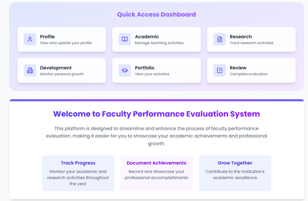
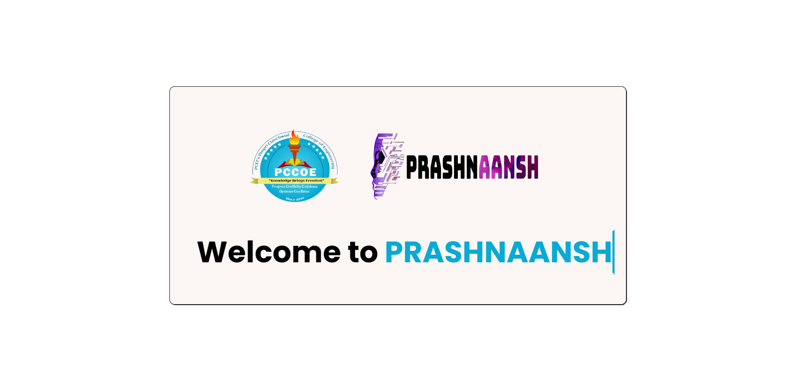
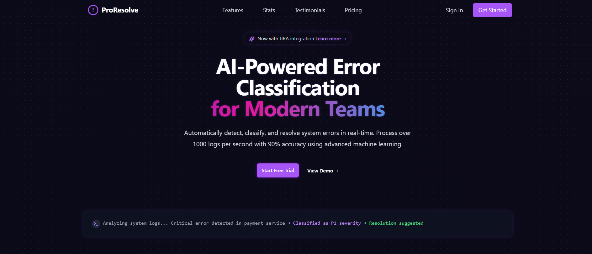
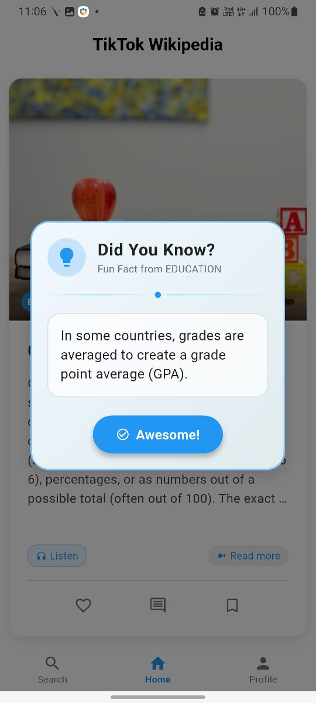

# 👨‍💻 Harshad Karale

  
  
  
  
  

## 🚀 About Me

I'm a Computer Engineering student at Pimpri Chinchwad College of Engineering, Pune with a passion for full-stack development and hackathons. My technical journey includes developing institutional-level applications and participating in numerous hackathons, frequently reaching finalist positions and winning awards.

- 🎓 B.Tech in Computer Engineering (Expected: May 2026)
- 📊 CGPA: 9.43/10.0
- 🏆 15+ Hackathon Finalist experiences
- 🏅 Multiple hackathon victories including Hactopia (1st) and BlueBit (1st Runner-up)
- 🏏 Cricket enthusiast and sports lover

## 💻 Technical Skills

| **Category** | **Technologies** |
|------------|----------------|
| **Languages** |     |
| **Frontend** |     |
| **Backend** |     |
| **Databases** |    |
| **Tools** |    |

## 🔥 Featured Projects

<table>
  <tr>
    <td width="50%">
      <h3 align="center">Faculty Appraisal System</h3>
      

        
        

          
          
          
        

        
Automated faculty assessment system with role-based access and two-phase evaluation process.

      

    </td>
    <td width="50%">
      <h3 align="center">Prashaansh</h3>
      

        
        

          
          
          
        

        
Desktop application for automated question paper generation using structured question bank and custom algorithms.

      

    </td>
  </tr>
  <tr>
    <td width="50%">
      <h3 align="center">ProResolve</h3>
      

        
        

          
          
          
        

        
Platform-wide bug tracking solution that identifies critical patterns affecting system performance.

      

    </td>
    <td width="50%">
      <h3 align="center">Wiki-Tok</h3>
      

        
        

          
          
          
        

        
TikTok-style Wikipedia app with infinite scrolling, text-to-speech, and hybrid recommendation system.

      

    </td>
  </tr>
</table>

## 🏆 Achievements

| Competition | Position | Date |
|-------------|----------|------|
| Baby Conference ACM, PCCOE (Best Research Paper) | 🥇 Winner | March 21, 2025 |
| Hactopia Hackathon by ACM PCCOE | 🥇 1st Place | October 22, 2024 |
| BlueBit National Level Hackathon by MSLC, PCCOE | 🥈 1st Runner-up | March 29, 2025 |
| MindSpark Hackathon by COEP, Pune | 🏅 4th Place | October 18-19, 2024 |

## 📜 Certifications

- **CS50AI:** Introduction To Artificial Intelligence with Python by Harvard University (June 2024)
- **CS50W:** CS50's Web Programming with Python and JavaScript by Harvard University (August 2024)
- **CS50x:** Introduction To Computer Science by Harvard University (August 2023)

## 📊 GitHub Stats

  
  
  

  

---

  

  
⭐️ From <a href="https://github.com/HarshadSanjayKarale">Harshad Karale</a>

